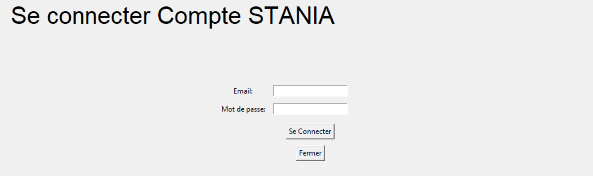

<h2 align="center">Bonjour, dans mon application bureautique STANIA, développée en Python, j'ai utilisé la bibliothèque Tkinter.</h2>
  
<h1 style="color:red;">-----------Installation de l'application sur votre Bureau</h1>

Veuillez telecharger le fichier **STANIA.rar** qui se trouve dans le chemin **"./output/"** et le decompresser, et ensuite cliquez sur l'application **STANIA** avec l'icone d'un football Americain comme indique sur l'image ci-dessous,

  
# Mon Application Tkinter

Cette application est développée en Python en utilisant la bibliothèque Tkinter pour l'interface graphique. Ce document vous guidera à travers les étapes nécessaires pour lancer l'application en local sur votre machine.

# II - Execution de l'application Tkinter
## 1 - Base de donnees

## 2 - Execution tkinter App

 

 

 

 

 

 
 
 

